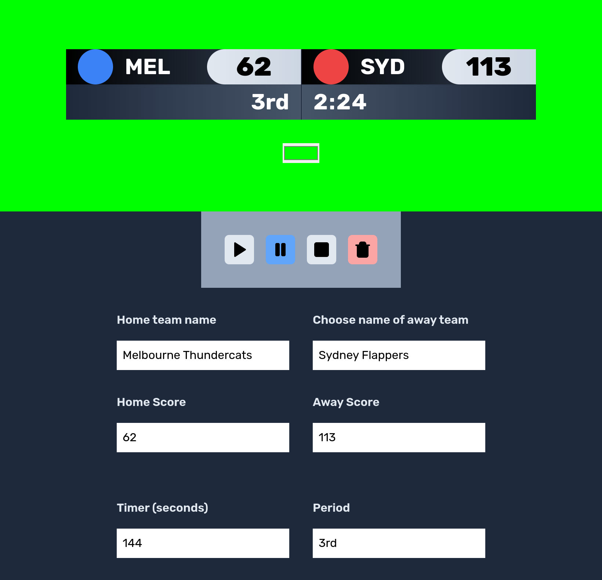

# Scobo

A simple scoreboard application made with [Solid](https://www.solidjs.com).



## Installation

```bash
    git clone https://github.com/kris-ms/scobo
    cd scobo
    bun install
    bun run dev # or bun run build
```

Favicon by [Freepik](https://www.flaticon.com/free-icons/scoreboard).
